# User manual

## Login
* To login to Fakebook press **Login** in top right corner of the screen (see picture 1).
* In the following page enter your credentials and press **Login** (see picture 2).
* If information you provided is not correct, you will get a corresponding error message.

*Picture 1*

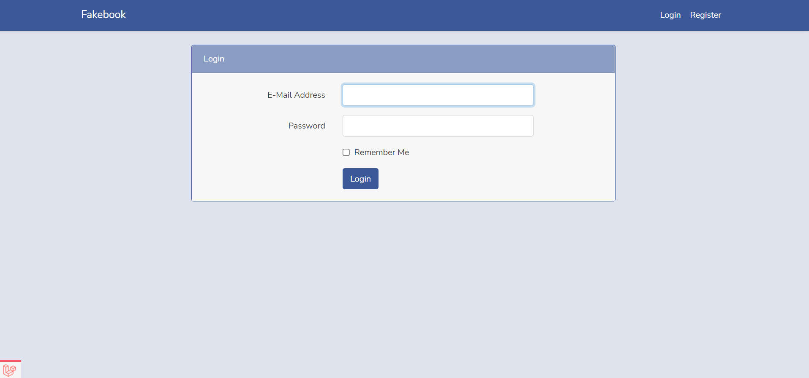
*Picture 2*

## Register
* To register to Fakebook press **Register** in top right corner of the screen (see picture 3).
* In the following page enter your fill in all fields and press **Register** (see picture 4).
* If information you provided is not correct, you will get a corresponding error message.

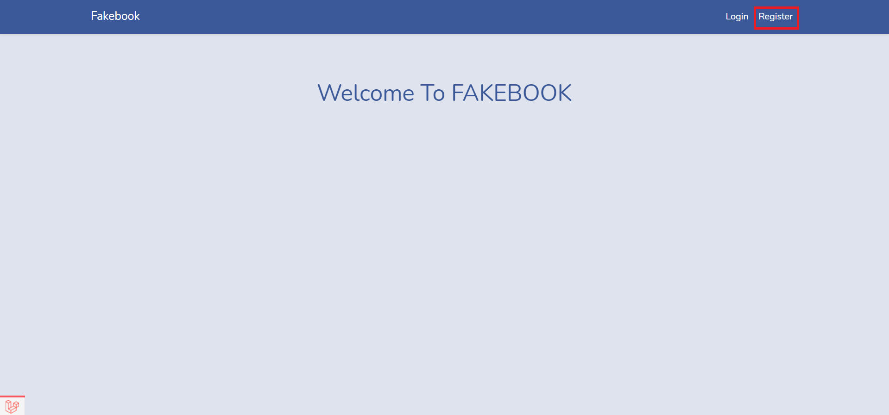
*Picture 3*

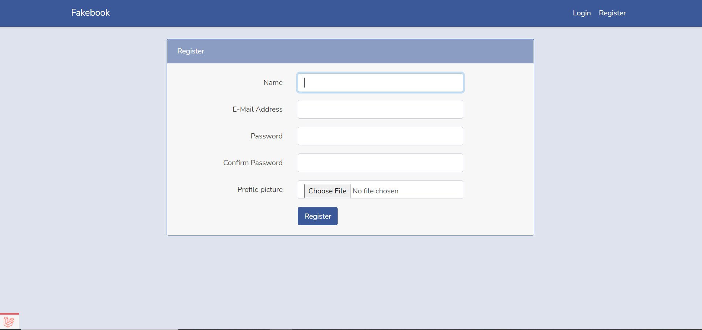
*Picture 4*

## Logout
* To log out from Fakebook press **Logout** in top right corner of the screen (see picture 5).

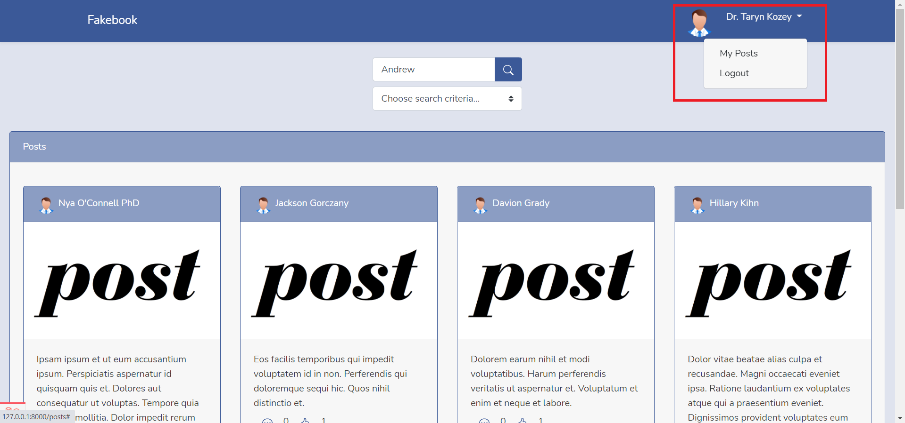
*Picture 5*

## Posts page

### Accessing Posts page
* After successful **login** and/or **registration** you will be redirected to **Posts page**.
* **Posts page** can also be accessed by pressing **Fakebook logo** in top left corner of the screen (see picture 6).

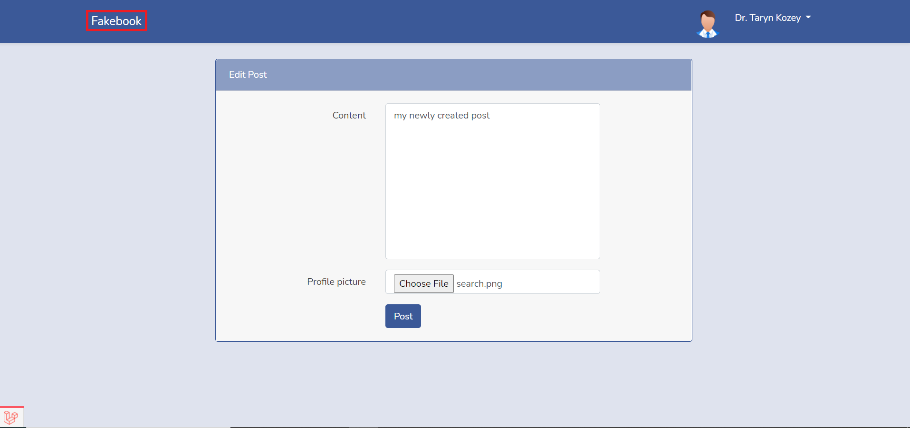
*Picture 6*

### Functionality
* In **Posts page** you can like a post (see picture 7).
* Also you can access post comments (see picture 8).
* There is functionality to search posts by author or post content. (see picture 9).

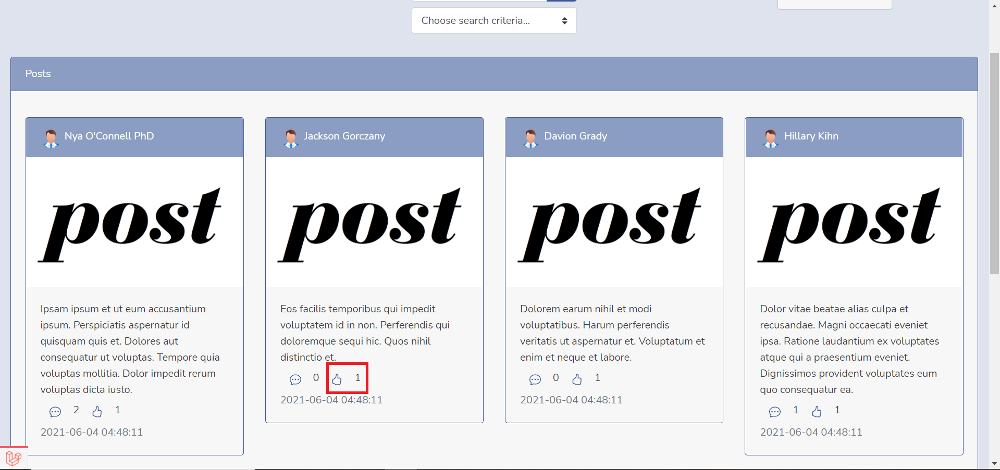
*Picture 7*

*Picture 8*

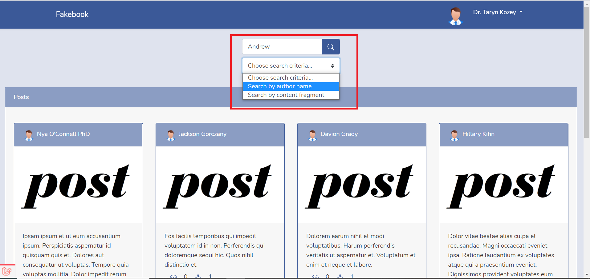
*Picture 9*

## Comments page
* In **Comments page** you can comment on a post and see all comments for that post (see picture 10).

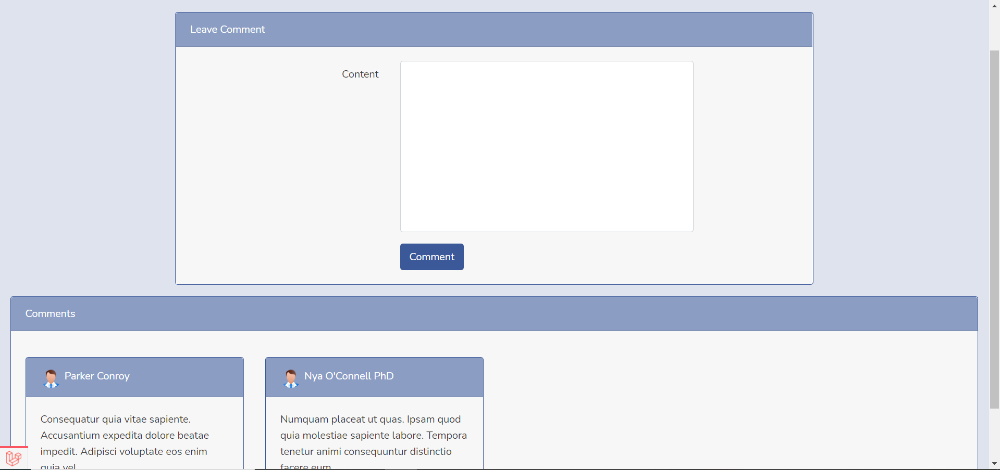
*Picture 10*

## My Posts page

### Accessing My Posts page
* **My Posts page** can be accessed by pressing **My Posts** on the top right corner of the screen (see picture 5).

### Functionality

#### Like, comment
* In **My Posts page** you can like and comment on a post the same way as in **Posts page**.

#### Creating post
* You can create post by pressing **Create post** (see picture 11).
* In the following page enter post content and attach image (if needed) and press **Post** (see picture 12).
* If information you provided is not correct, you will get a corresponding error message.

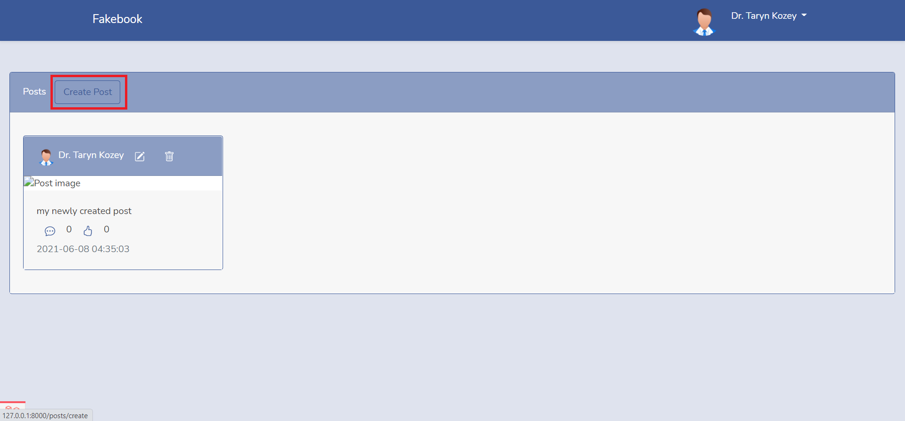
*Picture 11*

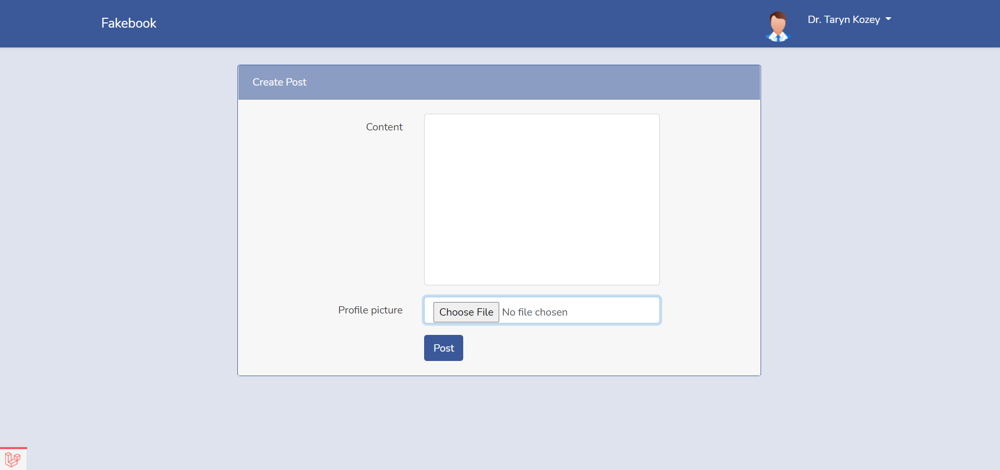
*Picture 12*

#### Editing post
* You can edit post by pressing **edit icon** on a post (see picture 13).
* In the following page edit post content and attach image (if needed) and press **Post** (see picture 14).
* If information you provided is not correct, you will get a corresponding error message.

*Picture 13*

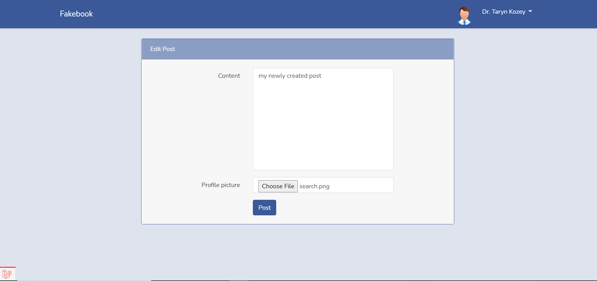
*Picture 14*

#### Deleting post
* You can delete post by pressing **delete icon** on a post (see picture 15).

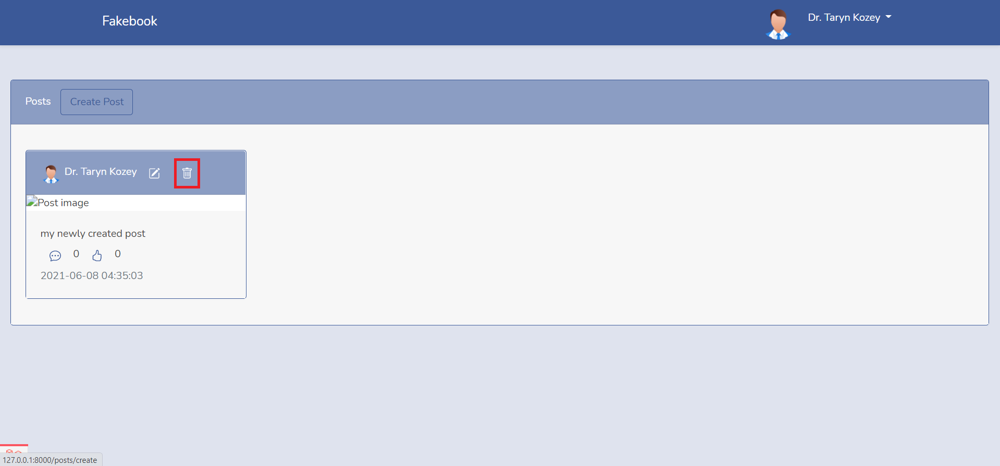
*Picture 15*

